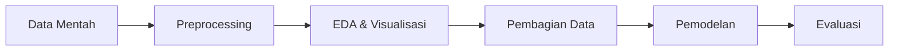

# 📊 ANALISIS PENELITIAN: Sentiment Analysis Kenaikan Tarif Transjakarta

## 📌 Ringkasan Penelitian

**Topik**: Analisis Sentimen terhadap Rencana Kenaikan Tarif Transjakarta  
**Metode**: Naive Bayes, SVM (Support Vector Machine), Random Forest  
**Sumber Data**: Komentar dari TikTok dan YouTube  
**Jumlah Data**: ~2,757 komentar (setelah preprocessing)  
**Klasifikasi**: Binary Classification (Positif vs Negatif)

---

## ✅ ASPEK YANG SUDAH BAIK

### 1. **Pipeline Penelitian Terstruktur** ✓
Penelitian Anda sudah mengikuti alur yang sistematis:



| Tahap | File | Status |
|-------|------|--------|
| Preprocessing | `preposseing.py` | ✅ Lengkap |
| EDA & Visualisasi | `EVD dan N-gram.py` | ✅ Lengkap |
| Pembagian Data | `pembagian data.py` | ✅ Lengkap |
| Pemodelan | `pemodelan.py` | ✅ Lengkap |

---

### 2. **Preprocessing yang Komprehensif** ✓

File [`preposseing.py`](file:///d:/STIS/Semester%205/Information%20Retrieval/Perkuliahan/Praktikum/Tugas%20Akhir%20Final/preposseing.py) sudah menerapkan teknik-teknik penting:

#### ✅ Teknik yang Sudah Diterapkan:
- **Emoji Removal** (line 80)
- **Case Folding** (lowercase, line 83)
- **Character Normalization** (menghapus karakter berulang seperti "mahallll" → "mahal", line 87)
- **Username/Hashtag/URL Removal** (line 90-92)
- **Slang Normalization** dengan kamus alay yang relevan (line 26-46)
- **Stopword Removal** dengan mempertahankan kata negasi (line 53)
- **Stemming** menggunakan Sastrawi (line 127)

> [!TIP]
> Kamus slang Anda sudah disesuaikan dengan konteks Transjakarta (tj, teje, jaklingko, dll). Ini sangat baik!

---

### 3. **Handling Imbalanced Data** ✓

Anda sudah menerapkan **SMOTE** (Synthetic Minority Over-sampling Technique) dengan benar:

- ✅ SMOTE hanya diterapkan pada **data training** (bukan testing)
- ✅ Menggunakan `stratify=y` pada train-test split
- ✅ Proporsi 80:20 sudah standar

> [!IMPORTANT]
> Penerapan SMOTE yang benar (hanya di training set) menunjukkan pemahaman yang baik tentang data leakage prevention.

---

### 4. **Pemilihan Model yang Tepat** ✓

Ketiga model yang dipilih sudah sesuai untuk sentiment analysis:

| Model | Kelebihan | Cocok untuk |
|-------|-----------|-------------|
| **Naive Bayes** | Cepat, efisien untuk teks | Baseline model, dataset besar |
| **SVM (Linear)** | Baik untuk high-dimensional data | Text classification |
| **Random Forest** | Robust, handle non-linear | Ensemble learning |

---

### 5. **Evaluasi Model yang Komprehensif** ✓

File [`pemodelan.py`](file:///d:/STIS/Semester%205/Information%20Retrieval/Perkuliahan/Praktikum/Tugas%20Akhir%20Final/pemodelan.py) sudah menggunakan:

- ✅ **Accuracy Score**
- ✅ **F1 Macro Score** (penting untuk imbalanced data)
- ✅ **Classification Report** (Precision, Recall, F1 per kelas)
- ✅ **Confusion Matrix** dengan visualisasi

> [!NOTE]
> Penggunaan F1 Macro sebagai metrik utama (line 122) sudah tepat untuk binary classification dengan data yang di-balance.

---

## ⚠️ ASPEK YANG PERLU DIPERBAIKI

### 1. **Feature Extraction: TF-IDF Configuration**

#### ❌ Masalah di `pembagian data.py`:
```python
# Line 35: max_features terlalu besar
tfidf = TfidfVectorizer(max_features=5000)
```

#### ❌ Masalah di `pemodelan.py`:
```python
# Line 50: Inkonsistensi parameter
tfidf = TfidfVectorizer(max_features=3000, ngram_range=(1,2))
```

#### 🔧 Rekomendasi:
- **Gunakan parameter yang sama** di kedua file
- Untuk dataset ~2,700 komentar, `max_features=3000` dengan bigram sudah cukup
- **Hapus file `pembagian data.py`** karena redundan (sudah ada di `pemodelan.py`)

```diff
# pemodelan.py - Line 50
-tfidf = TfidfVectorizer(max_features=3000, ngram_range=(1,2))
+tfidf = TfidfVectorizer(
+    max_features=3000, 
+    ngram_range=(1,2),
+    min_df=2,  # Tambahkan: abaikan kata yang muncul < 2 kali
+    max_df=0.8  # Tambahkan: abaikan kata yang muncul di >80% dokumen
+)
```

---

### 2. **Hyperparameter Tuning Belum Dilakukan**

#### ❌ Masalah:
Model menggunakan **default parameters** tanpa optimisasi:

```python
# Line 74-76: Parameter default
'Naive Bayes': MultinomialNB(),  # alpha=1.0 (default)
'SVM': SVC(kernel='linear'),     # C=1.0 (default)
'Random Forest': RandomForestClassifier(n_estimators=100, random_state=42)
```

#### 🔧 Rekomendasi:
Tambahkan **Grid Search** atau **Random Search** untuk mencari parameter terbaik:

```python
from sklearn.model_selection import GridSearchCV

# Contoh untuk SVM
param_grid_svm = {
    'C': [0.1, 1, 10, 100],
    'kernel': ['linear', 'rbf']
}

svm_grid = GridSearchCV(
    SVC(), 
    param_grid_svm, 
    cv=5, 
    scoring='f1_macro',
    n_jobs=-1
)
svm_grid.fit(X_train_resampled, y_train_resampled)
best_svm = svm_grid.best_estimator_
```

> [!WARNING]
> Tanpa hyperparameter tuning, Anda tidak bisa memastikan model sudah optimal. Ini akan menjadi pertanyaan penting saat presentasi/sidang.

---

### 3. **Cross-Validation Tidak Digunakan**

#### ❌ Masalah:
Evaluasi hanya menggunakan **single train-test split** (80:20):

```python
# Line 57-59: Hanya 1 kali split
X_train, X_test, y_train, y_test = train_test_split(
    X_tfidf, y, test_size=0.2, random_state=42, stratify=y
)
```

#### 🔧 Rekomendasi:
Tambahkan **K-Fold Cross-Validation** untuk hasil yang lebih robust:

```python
from sklearn.model_selection import cross_val_score

# Sebelum final testing, lakukan CV di training set
cv_scores = cross_val_score(
    model, 
    X_train_resampled, 
    y_train_resampled, 
    cv=5,  # 5-fold CV
    scoring='f1_macro'
)

print(f"CV F1 Scores: {cv_scores}")
print(f"Mean CV F1: {cv_scores.mean():.4f} (+/- {cv_scores.std():.4f})")
```

---

### 4. **Exploratory Data Analysis (EDA) Kurang Mendalam**

File [`EVD dan N-gram.py`](file:///d:/STIS/Semester%205/Information%20Retrieval/Perkuliahan/Praktikum/Tugas%20Akhir%20Final/EVD%20dan%20N-gram.py) sudah bagus, tapi bisa ditambahkan:

#### 📊 Visualisasi yang Perlu Ditambahkan:

1. **Distribusi Panjang Teks**
```python
df['text_length'] = df['text_clean'].apply(lambda x: len(str(x).split()))

plt.figure(figsize=(10, 5))
df.boxplot(column='text_length', by='Label_Teks', figsize=(8, 5))
plt.title('Distribusi Panjang Teks per Sentimen')
plt.suptitle('')
plt.ylabel('Jumlah Kata')
plt.show()
```

2. **Analisis Temporal** (jika ada timestamp)
```python
# Jika ada kolom tanggal
df['tanggal'] = pd.to_datetime(df['tanggal'])
df.groupby([df['tanggal'].dt.date, 'Label_Teks']).size().unstack().plot(kind='line')
plt.title('Tren Sentimen dari Waktu ke Waktu')
plt.show()
```

3. **Word Cloud untuk Positif** (saat ini hanya Negatif)
```python
# Line 61-64: Tambahkan juga untuk Positif
pos_data = df[df[col_label] == 'Positif'][col_text]
if len(pos_data) > 0:
    show_wordcloud(pos_data, 'Kata Kunci Paling Sering di Sentimen POSITIF')
```

---

### 5. **Dokumentasi dan Komentar Kode**

#### ⚠️ Masalah:
- Beberapa bagian kode kurang penjelasan
- Tidak ada docstring di fungsi-fungsi penting
- Tidak ada logging untuk tracking eksperimen

#### 🔧 Rekomendasi:
```python
def full_preprocessing(text):
    """
    Melakukan preprocessing lengkap pada teks komentar.
    
    Args:
        text (str): Teks komentar mentah
        
    Returns:
        str: Teks yang sudah dibersihkan dan dinormalisasi
        
    Tahapan:
        1. Cleaning (emoji, URL, mention, dll)
        2. Normalisasi slang
        3. Stopword removal
        4. Stemming
    """
    # ... kode preprocessing
```

---

## 🎯 REKOMENDASI PERBAIKAN PRIORITAS

### **HIGH PRIORITY** 🔴

1. **Tambahkan Hyperparameter Tuning**
   - Gunakan GridSearchCV atau RandomizedSearchCV
   - Dokumentasikan parameter terbaik yang ditemukan

2. **Implementasikan Cross-Validation**
   - Minimal 5-fold CV
   - Laporkan mean dan standard deviation dari metrik

3. **Perbaiki Inkonsistensi TF-IDF**
   - Gunakan parameter yang sama di semua file
   - Tambahkan `min_df` dan `max_df`

### **MEDIUM PRIORITY** 🟡

4. **Perluas EDA**
   - Tambahkan analisis panjang teks
   - Buat word cloud untuk kedua kelas
   - Analisis kata-kata yang paling diskriminatif

5. **Tambahkan Metrik Evaluasi Tambahan**
   - ROC-AUC Score
   - Precision-Recall Curve
   - Matthews Correlation Coefficient (MCC)

### **LOW PRIORITY** 🟢

6. **Dokumentasi**
   - Tambahkan docstring di semua fungsi
   - Buat README.md yang menjelaskan cara menjalankan kode
   - Dokumentasikan hasil eksperimen

7. **Code Refactoring**
   - Pisahkan konfigurasi ke file terpisah (config.py)
   - Buat utility functions untuk visualisasi
   - Hapus file redundan (`pembagian data.py`)

---

## 📝 STRUKTUR PENELITIAN YANG DISARANKAN

### File yang Sebaiknya Ada:

```
Tugas Akhir Final/
│
├── 📁 data/
│   ├── data_labeling_tj_tiktokyt_final.csv  # Data mentah
│   └── data_siap_model_2class.csv           # Data bersih
│
├── 📁 notebooks/  (TAMBAHKAN)
│   ├── 01_EDA.ipynb                         # Exploratory Data Analysis
│   ├── 02_Preprocessing.ipynb               # Eksperimen preprocessing
│   └── 03_Modeling.ipynb                    # Eksperimen model
│
├── 📁 src/
│   ├── config.py                            # Konfigurasi (TAMBAHKAN)
│   ├── preprocessing.py                     # Rename dari preposseing.py
│   ├── feature_extraction.py                # Pisahkan TF-IDF (TAMBAHKAN)
│   ├── modeling.py                          # Rename dari pemodelan.py
│   └── visualization.py                     # Rename dari EVD dan N-gram.py
│
├── 📁 results/  (TAMBAHKAN)
│   ├── model_comparison.csv                 # Hasil perbandingan model
│   ├── best_model.pkl                       # Model terbaik (saved)
│   └── figures/                             # Semua visualisasi
│
├── README.md                                # Dokumentasi (TAMBAHKAN)
└── requirements.txt                         # Dependencies (TAMBAHKAN)
```

---

## 🎓 PERTANYAAN YANG MUNGKIN MUNCUL SAAT PRESENTASI

### 1. **"Mengapa memilih ketiga model tersebut?"**
**Jawaban yang Baik**:
> "Saya memilih Naive Bayes sebagai baseline karena efisien untuk text classification. SVM dipilih karena terbukti efektif untuk high-dimensional data seperti TF-IDF. Random Forest dipilih untuk membandingkan pendekatan ensemble learning dengan model linear."

### 2. **"Apakah sudah melakukan hyperparameter tuning?"**
**Jawaban Saat Ini**: ❌ Belum  
**Solusi**: Implementasikan GridSearchCV sebelum presentasi

### 3. **"Bagaimana menangani overfitting?"**
**Jawaban yang Baik**:
> "Saya menggunakan train-test split dengan stratified sampling, menerapkan cross-validation, dan membatasi max_features di TF-IDF untuk mengurangi dimensi."

### 4. **"Mengapa menghapus data Netral?"**
**Jawaban yang Baik**:
> "Berdasarkan EDA, kelas Netral sangat sedikit (~12% dari total data) dan sulit dibedakan dari Positif/Negatif. Binary classification memberikan hasil yang lebih reliable dan fokus pada sentimen yang jelas."

### 5. **"Apa metrik evaluasi utama yang digunakan?"**
**Jawaban yang Baik**:
> "F1 Macro Score, karena memberikan bobot yang sama untuk kedua kelas (Positif dan Negatif) meskipun sudah di-balance dengan SMOTE. Ini lebih robust daripada accuracy untuk sentiment analysis."

---

## ✅ KESIMPULAN AKHIR

### **Apakah Penelitian Sudah Sesuai?**

| Aspek | Status | Catatan |
|-------|--------|---------|
| **Metodologi** | ✅ Sesuai | Pipeline sudah sistematis |
| **Preprocessing** | ✅ Sesuai | Teknik sudah komprehensif |
| **Pemilihan Model** | ✅ Sesuai | Ketiga model relevan |
| **Evaluasi** | ⚠️ Cukup Sesuai | Perlu tambahan CV dan tuning |
| **Dokumentasi** | ⚠️ Kurang | Perlu diperbaiki |

### **Penilaian Keseluruhan**: 7.5/10 ⭐⭐⭐⭐⭐⭐⭐☆☆☆

> [!IMPORTANT]
> **Penelitian Anda sudah SESUAI untuk tugas akhir**, namun masih ada ruang untuk perbaikan signifikan. Dengan menambahkan hyperparameter tuning dan cross-validation, nilai bisa naik menjadi 9/10.

### **Action Items untuk Segera Dikerjakan**:

1. ✅ **Hari Ini**: Tambahkan hyperparameter tuning
2. ✅ **Hari Ini**: Implementasikan cross-validation
3. ✅ **Besok**: Perbaiki EDA dan tambahkan visualisasi
4. ✅ **Besok**: Buat dokumentasi lengkap (README.md)
5. ✅ **Sebelum Presentasi**: Latihan menjawab pertanyaan kritis

---

## 📚 REFERENSI TAMBAHAN

Untuk memperkuat penelitian, pertimbangkan menambahkan referensi ke:

1. **Paper tentang SMOTE**: Chawla et al. (2002) - "SMOTE: Synthetic Minority Over-sampling Technique"
2. **Text Preprocessing**: Haddi et al. (2013) - "The Role of Text Pre-processing in Sentiment Analysis"
3. **SVM untuk Text**: Joachims (1998) - "Text Categorization with Support Vector Machines"
4. **Sentiment Analysis Indonesia**: Penelitian lokal tentang sentiment analysis Bahasa Indonesia

---

> [!TIP]
> **Saran Terakhir**: Fokuskan perbaikan pada hyperparameter tuning dan cross-validation terlebih dahulu. Kedua hal ini akan sangat meningkatkan kredibilitas penelitian Anda dan menjawab pertanyaan kritis dari penguji.

**Semoga sukses dengan penelitian Anda!** 🚀
